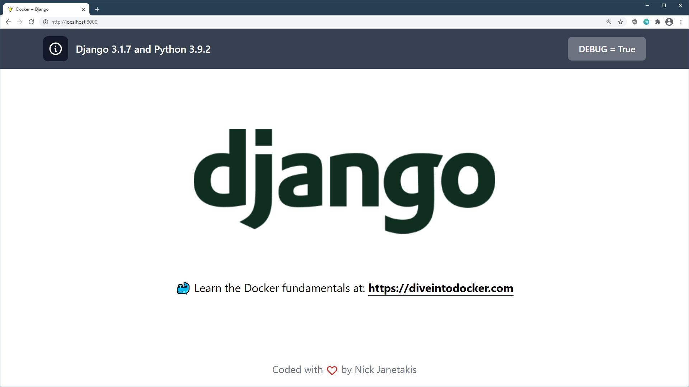

# An example Django + Docker app


You could use this example app as a base for your new project or as a guide to
Dockerize your existing Django app.

The example app is minimal but it wires up a number of things you might use in
a real world Django app, but at the same time it's not loaded up with a million
personal opinions.

For the Docker bits, everything included is an accumulation of Docker best
practices based on building and deploying dozens of assorted Dockerized web
apps since late 2014.

**This app is using Django 3.1.7 and Python 3.9.2**. The screenshot doesn't get
updated every time I bump the versions:

[](https://github.com/nickjj/docker-django-example/blob/main/.github/docs/screenshot.jpg?raw=true)

## Table of contents

- [Tech stack](#tech-stack)
- [Notable opinions and extensions](#notable-opinions-and-extensions)
- [Running this app](#running-this-app)
- [Files of interest](#files-of-interest)
  - [`.env`](#env)
  - [`run`](#run)
- [Making this app your own](#making-this-app-your-own)
- [Updating dependencies](#updating-dependencies)
- [See a way to improve something?](#see-a-way-to-improve-something)
- [Additional resources](#additional-resources)
  - [Learn more about Docker and Django](#learn-more-about-docker-and-django)
  - [Deploy to production](#deploy-to-production)
- [About the author](#about-the-author)

## Tech stack

If you don't like some of these choices that's no problem, you can swap them
out for something else on your own.

### Back-end

- [PostgreSQL](https://www.postgresql.org/)
- [Redis](https://redis.io/)
- [Celery](https://github.com/celery/celery)

### Front-end

- [Webpack](https://webpack.js.org/)
- [TailwindCSS](https://tailwindcss.com/)
- [Heroicons](https://heroicons.com/)

#### But what about JavaScript?!

Picking a JS library is a very app specific decision because it depends on
which library you like and it also depends on if your app is going to be
mostly Jinja templates with sprinkles of JS or an API back-end.

This isn't an exhaustive list but here's a few reasonable choices depending on
how you're building your app:

- <https://hotwire.dev/>
- <https://github.com/alpinejs/alpine>
- <https://vuejs.org/>
- <https://reactjs.org/>
- <https://jquery.com/>

On the bright side with Webpack being set up you can use any (or none) of these
solutions very easily. You could follow a specific library's Webpack
installation guides to get up and running in no time.

Personally I'm going to be using Hotwire Turbo + Stimulus in most newer
projects.

## Notable opinions and extensions

Django is an opinionated framework and I've added a few extra opinions based on
having Dockerized and deployed a number of Django projects. Here's a few (but
not all) note worthy additions and changes.

- **Packages and extensions**:
    - *[gunicorn](https://gunicorn.org/)* for an app server in both development and production
    - *[whitenoise](https://github.com/evansd/whitenoise)* for serving static files
- **Linting and testing**:
    - *[flake8](https://github.com/PyCQA/flake8)* is used to lint the code base
- **Django apps**:
    - Add `pages` app with a `/` page and `/up` health check endpoint
- **Config**:
    - Log to STDOUT so that Docker can consume and deal with log output 
    - Extract a bunch of configuration settings into environment variables
    - `src/hello/settings.py` and the `.env` file handles configuration in all environments
- **Front-end assets**:
    - `assets/` contains all your CSS, JS, images, fonts, etc. and is managed by Webpack
    - Custom `502.html` and `maintenance.html` pages
    - Generate favicons using modern best practices
- **Django defaults that are changed**:
    - Use Redis as the default Cache back-end
    - Use signed cookies as the session back-end
    - `public/` is the static directory where Django will serve static files from
    - `public_collected/` is where `collectstatic` will write its files to

Besides the Django app itself:

- Docker support has been added which would be any files having `*docker*` in
  its name
- GitHub Actions have been set up
- A `requirements-lock.txt` file has been introduced using `pip3`. The
  management of this file is fully automated by the commands found in the `run`
  file. We'll cover this in more detail when we talk about [updating
  dependencies](#updating-dependencies).

## Running this app

You'll need to have [Docker installed](https://docs.docker.com/get-docker/).
It's available on Windows, macOS and most distros of Linux. If you're new to
Docker and want to learn it in detail check out the [additional resources
links](#learn-more-about-docker-and-django) near the bottom of this README.

If you're using Windows, it will be expected that you're following along inside
of [WSL or WSL
2](https://nickjanetakis.com/blog/a-linux-dev-environment-on-windows-with-wsl-2-docker-desktop-and-more).
That's because we're going to be running shell commands. You can always modify
these commands for PowerShell if you want.

#### Clone this repo anywhere you want and move into the directory:

```sh
git clone https://github.com/nickjj/docker-django-example hellodjango
cd hellodjango

# Optionally checkout a specific tag, such as: git checkout 0.3.0
```

#### Copy a few example files because the real files are git ignored:

```sh
cp .env.example .env
cp docker-compose.override.yml.example docker-compose.override.yml
```

#### Build everything:

*The first time you run this it's going to take 5-10 minutes depending on your
internet connection speed and computer's hardware specs. That's because it's
going to download a few Docker images and build the Python + Yarn dependencies.*

```sh
docker-compose up --build
```

Now that everything is built and running we can treat it like any other Django
app.

Did you receive an error about a port being in use? Chances are it's because
something on your machine is already running on port 8000. Check out the docs
in the `.env` file for the `DOCKER_WEB_PORT_FORWARD` variable to fix this.

#### Setup the initial database:

```sh
# You can run this from a 2nd terminal.
./run manage migrate 
```

*We'll go over that `./run` script in a bit!*

#### Check it out in a browser:

Visit <http://localhost:8000> in your favorite browser.

Not seeing any CSS? That means Webpack is still compiling. Give it
a few more seconds and reload. It should self resolve.

#### Linting the code base:

```sh
# You should get no output (that means everything is operational).
./run flake8
```

#### Running the test suite:

```sh
# You should see all passing tests. Warnings are typically ok.
./run manage test
```

#### Stopping everything:

```sh
# Stop the containers and remove a few Docker related resources associated to this project.
docker-compose down
```

You can start things up again with `docker-compose up` and unlike the first
time it should only take seconds.

## Files of interest

I recommend checking out most files and searching the code base for `TODO:`,
but please review the `.env` and `run` files before diving into the rest of the
code and customizing it. Also, you should hold off on changing anything until
we cover how to customize this example app's name with an automated script
(coming up next in the docs).

### `.env`

This file is ignored from version control so it will never be commit. There's a
number of environment variables defined here that control certain options and
behavior of the application. Everything is documented there.

Feel free to add new variables as needed. This is where you should put all of
your secrets as well as configuration that might change depending on your
environment (specific dev boxes, CI, production, etc.).

### `run`

You can run `./run` to get a list of commands and each command has
documentation in the `run` file itself.

It's a shell script that has a number of functions defined to help you interact
with this project. It's basically a `Makefile` except with less limitations.
For example as a shell script it allows us to pass any arguments to another
program.

This comes in handy to run various Docker commands because sometimes these
commands can be a bit long to type. Feel free to add as many convenience
functions as you want. This file's purpose is to make your experience better!

*If you get tired of typing `./run` you can always create a shell alias with
`alias run=./run` in your `~/.bash_aliases` or equivalent file. Then you'll be
able to run `run` instead of `./run`.*

## Making this app your own

The app is named `hello` right now but chances are your app will be a different
name. Since the app is already created we'll need to do a find / replace on a
few variants of the string "hello" and update a few Docker related resources.

You can do that from the command line without needing to install any extra
dependencies by following the instructions below.

#### Remove the original Docker resources:

When the hello app was first upped with Docker Compose a new database, user and
password was created automatically based on the values of certain environment
variables.

Along with that a few Docker resources were created too. Those need to be
updated. The easiest way to do that is by removing the old Docker resources and
deleting the database. We can do all of that in 1 command.

*Don't worry, you won't have to wait 5-10 minutes again when you up your newly
named project. Docker still that information safely tucked away and it can be
re-used in projects with different names.*

```sh
# This removes the PostgreSQL database volume along with a few other Docker
# resources that were created and are associated to the hello app.
docker-compose down -v
```

#### Run these commands from the same directory as this git repo:

```sh
# Change hello to be whatever you want your app name to be.
#
# After renaming this value, paste this variable into your terminal.
lower=hello

# If you wanted a multi-word app name you could do:
# lower=my_app
#
# or:
#
# lower=myapp
#
# The choice is yours!

# Recursively replace hello using the values defined above.
#
# You don't need to edit this command before running it in your terminal.
find . -type f -exec perl -i -pe "s/(hellodjango|hello)/${lower}/g" {} + \
  && mv src/hello/ src/"${lower}"
```

If you're not comfortable running these commands or they don't work for
whatever reason, you can also do a case sensitive find / replace within your
code editor too. There's nothing special going on here. It's literally
replacing "hellodjango" and "hello" with your lowercase app name and then
renaming a directory.

#### Verify everything was changed successfully:

```sh
grep -ER --exclude-dir public/ --exclude-dir public_collected/ hello .
```

You should get back no output. That means all occurrences of hello were
replaced.

```sh
grep -ER --exclude README.md --exclude-dir .git/ --exclude-dir \
  --exclude-dir assets/node_modules/ \
  --exclude-dir public/ --exclude-dir public_collected/ "${lower}" .
```

You should get back a bunch of output showing you where your app name is
referenced within the project.

#### Remove the `.git` directory and init a new git repo:

This project is not meant to be a long running fork. It's your freshly minted
project that is ready for you to start modifying based on whatever cool app you
want to build.

```sh
rm -rf .git/
git init

# Optionally use main as a branch instead of master. CI is configured to work
# with both main and master btw.
git symbolic-ref HEAD refs/heads/main
```

#### Start and setup the project:

We don't need to rebuild anything yet. Upping it is enough for Docker to
re-create new resources with the new name. We'll also need to setup our
database since a new one will be created for us by Docker.

```sh
docker-compose up

# Then in a 2nd terminal once it's up and ready.
./run manage migrate
```

#### Sanity check to make sure the tests still pass:

It's always a good idea to make sure things are in a working state before
adding custom changes.

```sh
# You can run this from the same terminal as before.
./run flake8
./run manage test
```

If everything passes now you can optionally `git add -A && git commit -m
"Initial commit"` and start customizing your app. Alternatively you can wait
until you develop more of your app before committing anything. It's up to you!

#### Tying up a few loose ends:

You'll probably want to create a fresh `CHANGELOG.md` file for your project. I
like following the style guide at <https://keepachangelog.com/> but feel free
to use whichever style you prefer.

Since this project is MIT licensed you should keep my name and email address in
the `LICENSE` file to adhere to that license's agreement, but you can also add
your name and email on a new line.

If you happen to base your app off this example app or write about any of the
code in this project it would be rad if you could credit this repo by linking
to it. If you want to reference me directly please link to my site at
<https://nickjanetakis.com>. You don't have to do this, but it would be very
much appreciated!

## Updating dependencies

Let's say you've customized your app and it's time to make a change to your
`requirements.txt` or `package.json` file.

Without Docker you'd normally run `pip3 install -r requirements.txt` or `yarn
install`. With Docker it's basically the same thing and since these commands
are in our `Dockerfile` we can get away with doing a `docker-compose build` but
don't run that just yet.

#### In development:

You can run `./run pip3:outdated` or `./run yarn:outdated` to get a list of
outdated dependencies based on what you currently have installed. Once you've
figured out what you want to update, go make those updates in your
`requirements.txt` and / or `assets/package.json` file.

Then to update your dependencies you can run `./run pip3:install` or `./run
yarn:install`. That'll make sure any lock files get copied from Docker's image
(thanks to volumes) into your code repo and now you can commit those files to
version control like usual.

You can check out the
[run](https://github.com/nickjj/docker-django-example/blob/main/run) file to see
what these commands do in more detail.

As for the requirements' lock file, this ensures that the same exact versions
of every package you have (including dependencies of dependencies) get used the
next time you build the project. This file is the output of running `pip3
freeze`. You can check how it works by looking at
[bin/pip3-install](https://github.com/nickjj/docker-django-example/blob/main/bin/pip3-install).

You should never modify the lock files by hand. Add your top level Python
dependencies to `requirements.txt` and your top level JavaScript dependencies
to `assets/package.json`, then run the `./run` command(s) mentioned earlier.

#### In CI:

You'll want to run `docker-compose build` since it will use any existing lock
files if they exist. You can also check out the complete CI test pipeline in
the [run](https://github.com/nickjj/docker-django-example/blob/main/run) file
under the `ci:test` function.

#### In production:

This is usually a non-issue since you'll be pulling down pre-built images from
a Docker registry but if you decide to build your Docker images directly on
your server you could run `docker-compose build` as part of your deploy
pipeline.

## See a way to improve something?

If you see anything that could be improved please open an issue or start a PR.
Any help is much appreciated!

## Additional resources

Now that you have your app ready to go, it's time to build something cool! If
you want to learn more about Docker, Django and deploying a Django app here's a
couple of free and paid resources. There's Google too!

### Learn more about Docker and Django

#### Official documentation 

- <https://docs.docker.com/>
- <https://docs.djangoproject.com/en/3.1/>

#### Courses / books

- [https://diveintodocker.com](https://diveintodocker.com?ref=docker-django-example)
  is a course I created which goes over the Docker and Docker Compose
  fundamentals
- William Vincent has a bunch of [beginner and advanced Django
  books](https://gumroad.com/a/139727987). He also co-hosts the [Django
  Chat](https://djangochat.com/) podcast

### Deploy to production

I'm creating an in-depth course related to deploying Dockerized web apps. If
you want to get notified when it launches with a discount and potentially get
free videos while the course is being developed then [sign up here to get
notified](https://nickjanetakis.com/courses/deploy-to-production).

## About the author

- Nick Janetakis | <https://nickjanetakis.com> | [@nickjanetakis](https://twitter.com/nickjanetakis)

I'm a self taught developer and have been freelancing for the last ~20 years.
You can read about everything I've learned along the way on my site at
[https://nickjanetakis.com](https://nickjanetakis.com/).

There's hundreds of [blog posts](https://nickjanetakis.com/blog/) and a couple
of [video courses](https://nickjanetakis.com/courses/) on web development and
deployment topics. I also have a [podcast](https://runninginproduction.com)
where I talk with folks about running web apps in production.
